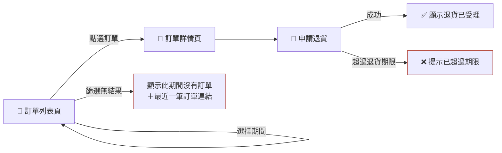

# behavior-mapping — 行為地圖紀律

行為地圖讓人**一張圖看懂**：這個需求有哪些畫面、每個畫面有哪些操作、按了走哪條線、哪裡有失敗與例外。它只負責讓使用者看懂流程、找缺漏——不承載狀態、版本或決策紀錄。

> 設定檔住 `behaviors/config.md`（「場景資料夾」欄位決定實際根目錄）；沒有設定檔就用預設值。

## 何時重畫

- **自動觸發**：這次對話裡任何 `.feature` 被建立或修改，落地後**立刻**重畫 `map.md` 覆蓋舊檔——不等使用者提醒。
- **整檔重寫**：重畫＝從場景檔重新推導、整檔覆蓋——禁止在舊圖上增量修補局部段落。
- **單向生成**：只從場景檔生成地圖，絕不反向修改場景檔。
- **差異摘要**：舊圖存在時，重畫後向使用者摘要行為差異（新增／移除／改動了哪些節點與路徑）。
- **矛盾偵測**：場景互相矛盾（同一操作兩種結果且條件無法區分）→ 停下指出矛盾，讓使用者先修場景。
- 不碰 MVP——那是 `/to-mvp` 的事。

## 檔頭（只有一行）

```markdown
> 本檔由同目錄 *.feature 生成，手改無效——改需求請改場景檔後重畫。
```

## 畫法

用 Mermaid flowchart，內嵌在 `map.md`：

- **畫面＝節點**（📄 前綴）、**操作／按鈕＝邊或 🔘 節點**、**結果＝終端節點**。
- **畫面名稱是領域詞彙**：同一個實體畫面在所有需求的地圖必須同名，名稱以 `CONTEXT.md` 詞彙表為準（還沒有就依 `domain-language` 先立詞條）。命名不一致，同一頁會在圖上裂成兩個節點。
- **失敗與例外路徑一律標紅**：`style X stroke:#B5483B`。
- **圖上每個節點與邊，都必須能對應回至少一條場景**；場景裡沒有的東西不准出現在圖上（圖不能比場景多）。
- 反過來，每條場景都要在圖上找得到自己；漏畫的場景是 bug。
- **外部節點**：不屬於本需求的畫面——以 Given 前提出現，或作為結果被導向（例如導向登入頁）——一律畫成虛線連接的外部節點並標注來源：`EXT["📄 訂單列表頁（外部：見 order-list）"] -.->|"點選訂單"| D[...]`——**不畫對方的內部行為**（那是對方場景的事，不是本圖的）。



## 太大看不完時

分兩層：一張**總圖**只畫畫面與畫面之間的流向；每個畫面再各一張**細圖**畫到操作級。單張圖節點超過約 15 個就該分層。

## Mermaid 語法地雷

- 節點文字一律用雙引號包：`A["文字"]`——括號、斜線、emoji 才不會炸。
- `subgraph` 標題含括號或特殊字元時，必須給 ID 再引號包標題：`subgraph g1["標題（說明）"]`，不可裸寫。
- 邊上的標籤同樣用引號：`-->|"標籤"|`。
