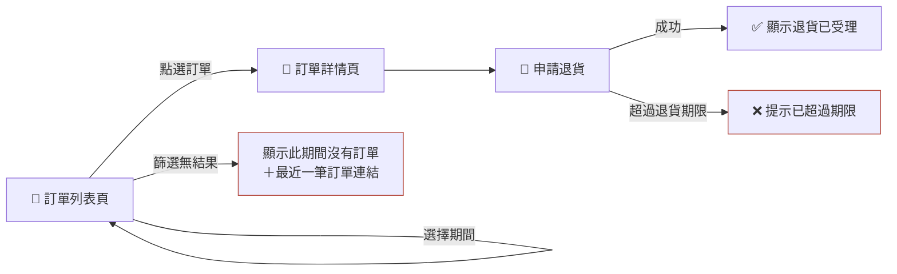

# behavior-mapping — 行為地圖紀律

行為地圖讓人**一張圖看懂**：這個功能有哪些畫面、每個畫面有哪些操作、按了走哪條線、哪裡有失敗與例外。

## 何時重畫（觸發規則）

- **自動觸發**：只要這次對話裡有任何 `.feature` 被建立或修改，改動落地後**立刻**重新生成 `map.md` 覆蓋舊檔——不等使用者提醒。過期的地圖是謊言，比沒有地圖更糟。
- **整檔重寫**：重新生成＝從場景檔重新推導、**整檔覆蓋**（含檔頭）——禁止在舊地圖上增量修補局部段落；增量修補會累積圖與真相的漂移。

## 總覽頁（behaviors/index.html）

任何 `map.md` 重生時、以及任何功能的 `mvp/` 產出更新時，**一併重生** `behaviors/index.html` 總覽頁（同為生成產物，手改無效），兩個分區：

- **按功能**：每個需求資料夾一列——名稱、狀態（討論中／已凍結＋日期）、場景數／失敗路徑數、MVP 連結（該功能的 `mvp/index.html` 存在才附）。
- **按畫面反查**：從**所有**功能地圖的畫面節點與外部入口節點，反推「畫面 → 涉及的功能」索引。同一畫面掛太多功能＝結構腐化的警報。

總覽頁住在 `behaviors/` 根層，不隨任何交付走。
- **單向生成**：只從場景檔生成地圖，絕不反向修改場景檔。
- **差異摘要**：舊地圖存在時，生成後向使用者摘要與上一版的行為差異（新增／移除／改動了哪些節點與路徑）。
- **矛盾偵測**：場景檔互相矛盾（同一顆按鈕兩種結果且條件無法區分）→ 停下來指出矛盾，讓使用者先修場景。

## 地圖是生成產物

`map.md` 由場景檔單向生成。檔頭必須寫：

```markdown
> ⚠️ 本檔為生成產物，手改無效。行為真相在同目錄的 *.feature。
> 狀態: 討論中｜已凍結 <日期>

已定案的關鍵決定：<本功能訪談中拍板的行為決定，一行寫完、以「｜」分隔>
依賴：<本功能以 Given 引用的其他功能 slug（狀態）>
變更紀錄：<日期＋一句摘要，凍結時累加，最新在前>
```

「依賴」由場景的 Given 推導（引用了哪些別的功能的畫面／行為）；無依賴則省略該行。「變更紀錄」由 `/remap` 重新凍結時累加。

「已定案的關鍵決定」是檔頭**必備區塊**，內容來自**這個功能自己的訪談**（例：一個查詢功能拍板過「預設顯示近三十天｜失敗保留輸入」），記錄行為決定、解釋場景「為什麼長這樣」。它是行為層決定，不是 ADR（技術決定屬於下游）；詞彙定義也不放這裡（那是 `CONTEXT.md` 的事）。

## 畫法

用 Mermaid flowchart，內嵌在 `map.md`：

- **畫面＝節點**（📄 前綴）、**操作／按鈕＝邊或 🔘 節點**、**結果＝終端節點**。
- **失敗與例外路徑一律標紅**：`style X stroke:#B5483B`。
- **圖上每個節點與邊，都必須能對應回至少一條場景**；場景裡沒有的東西不准出現在圖上（圖不能比真相多）。
- 反過來，每條場景都要在圖上找得到自己；漏畫的場景是 bug。
- **外部入口節點**：不屬於本功能的畫面（**其他功能資料夾的，或未納入盤點的既有系統的**）以 Given 前提出現時，畫成虛線連接的外部節點並標注來源——`EXT["📄 訂單列表頁（外部：見 order-list）"] -.->|"點選訂單"| D[...]`——**不畫對方的內部行為**（那是對方場景的真相，不是本圖的）。



## 太大看不完時

分兩層：一張**總圖**只畫畫面與畫面之間的流向；每個畫面再各一張**細圖**畫到按鈕級。單張圖節點超過約 15 個就該分層。

## Mermaid 語法地雷

- 節點文字一律用雙引號包：`A["文字"]`——括號、斜線、emoji 才不會炸。
- `subgraph` 標題含括號或特殊字元時，必須給 ID 再引號包標題：`subgraph g1["標題（說明）"]`，不可裸寫。
- 邊上的標籤同樣用引號：`-->|"標籤"|`。
